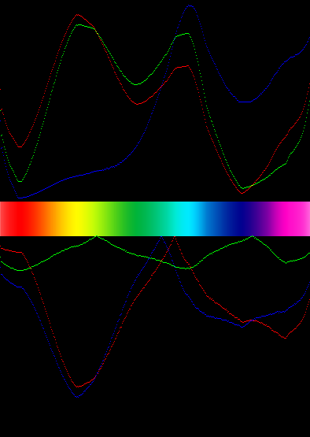

# LMSchart

This program is designed to take a horizontal line of pixels from the middle of the input image. It will then graph it on the top half of the output image. Each channel is converted from rgb to lms then graphed on the top half of the output image. Long cone activation is represented by the red line, medium by green, and short by blue. 

The closer two lines are the harder it will be for a colorblind person to see differences in nearby colors depending on the type of colorblindness. 
People with Deuteranomaly, for example, would have difficulty seeing the difference in colors when the red and green line are close together.

The bottom half of the graph shows the difficulty of this color type (higher is harder). Red represents medium and short confusion. Blue represents long and short confusion. Green represents long and medium confusion (typically deuteranomaly). The graph goes from 0-255, but will rarely reach the lower peak due to the nature of the lms colorspace.


## Getting Started

The python file contains all of the code necessary to run.

### Prerequisites

requirements.txt has the packages required to run this program. If this cannot be used, install numpy and opencv.

```
pip install -r requirements.txt
```

## Running the code

You must provide a filename as input in the command line
```
python lmschart.py [filename here]
```
such as
```
python lmschart.py spec.png
```

It will then create a file called spec_chart.png containing the output file.

## Example
Original image<br/>
<br/>
Output image<br/>
<br/>


## References/More information

* http://www.colourblindawareness.org/colour-blindness/types-of-colour-blindness/

* An Adaptive Fuzzy-Based System to Simulate, Quantify and Compensate Color Blindness (page 4) <br/> https://arxiv.org/pdf/1711.10662.pdf

